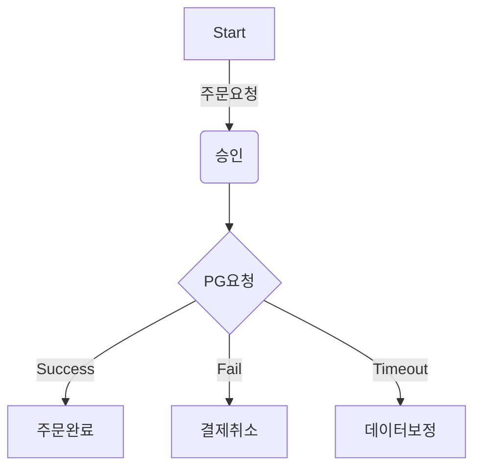

# career-architecture
> mermaid로 작성된 과제는 마크다운 파일(ARCHITECTURE.md)로 올려주시면 됩니다. (md 파일 내에 기존 구조를 넣어주세요)
> 별도 아키택쳐나 모델링 도구를 사용한 경우에는 마크다운 파일(ARCHITECTURE.md)과 png, gif, jpg, pdf 파일 형식으로 architecture-{gitID}.png 파일명으로 upload 해주세요
# 요구사항
- [ ] 담당 하는 업무에서 비효율적인 프로세스나 기술적 개선을 하고 싶은 부분의 현재 구조를 문서화 한다.
    - [ ] 비효율적인 부분에 대한 분석내용을 정리한다.
    - [ ] 비효율적인 부분에 대한 프로세스 또는 시스템 구조를 그려본다.

## 🚀미션
- 이름 : 장진달
### 개선포인트 분석
- 매일 전날의 결제 데이터중 timeout이 발생한 결제 건에 대한 리포트를 받아서 해당건을 확인 하고 있다.
- timeout이 발생하였을 경우 해당 건이 PG에서 결제가 되엇는지 안되엇는지? 알수 없기 때문에 해당 승인건의 key를 pg사의 관리자 페이지에서 하나하나 확인 한다.
- 승인되었다면 해당 건을 취소하고 운영DB에 결제 실패로 수기 처리한다.
- 승인이 되지 않았다면 운영DB에 결제 실패로 수기 처리한다.
- 매일 timeout건을 확인하고 처리하는데 하루 2시간씩 고정적인 비용이 발생하고 있다. 
 
### 프로세스

