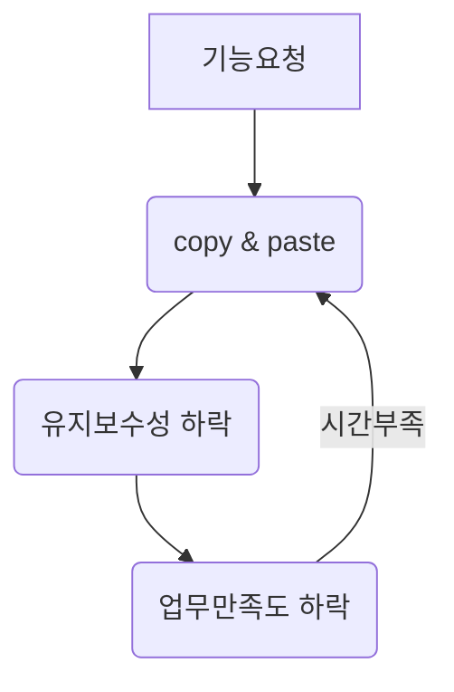

# career-architecture
> mermaid로 작성된 과제는 마크다운 파일(ARCHITECTURE.md)로 올려주시면 됩니다. (md 파일 내에 기존 구조를 넣어주세요) 
> 별도 아키택쳐나 모델링 도구를 사용한 경우에는 마크다운 파일(ARCHITECTURE.md)과 png, gif, jpg, pdf 파일 형식으로 architecture-{gitID}.png 파일명으로 upload 해주세요
# 요구사항
- [ ] 담당 하는 업무에서 비효율적인 프로세스나 기술적 개선을 하고 싶은 부분의 현재 구조를 문서화 한다.
    - [ ] 비효율적인 부분에 대한 분석내용을 정리한다.
    - [ ] 비효율적인 부분에 대한 프로세스 또는 시스템 구조를 그려본다.

# 예시 2

## 🚀미션
- 이름 : 장진달
### 개선포인트 분석
- 대부분의 업무가 기능 요청이 오면 기존의 비슷한 기능을 copy & paste해서 수정한다.
- copy를 하였기 때문에 새로운 기술의 적용이 어렵고 원본에서의 오류가 있다면 모든 copy된 파일을 수정해야하는 등 비효율적인 면이 많다.
- 수정등 유지보수에 시간이 너무 많이 소요되어 항상 시간이 부족하다.
### 프로세스

