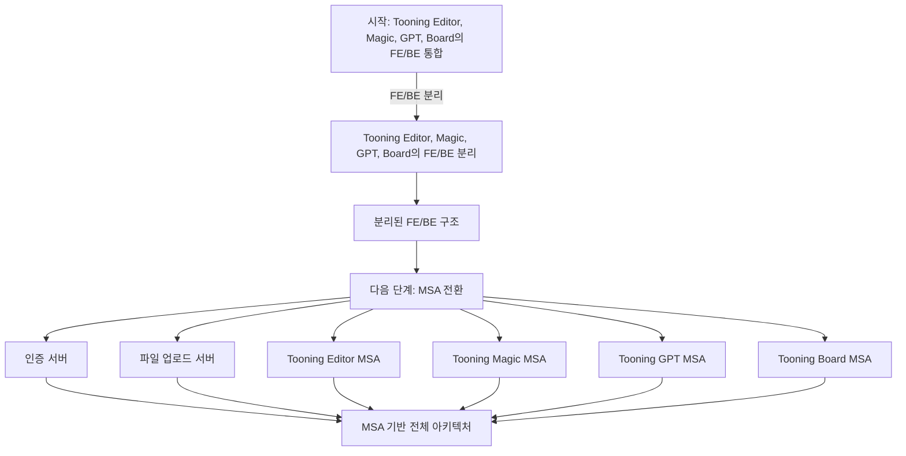

# career-architecture
> mermaid로 작성된 과제는 마크다운 파일(ARCHITECTURE.md)로 올려주시면 됩니다. (md 파일 내에 기존 구조를 넣어주세요) 
> 별도 아키택쳐나 모델링 도구를 사용한 경우에는 마크다운 파일(ARCHITECTURE.md)과 png, gif, jpg, pdf 파일 형식으로 architecture-{gitID}.png 파일명으로 upload 해주세요

# 요구사항

- [ ] 담당 하는 업무에서 비효율적인 프로세스나 기술적 개선을 하고 싶은 부분의 현재 구조를 문서화 한다.
    - [ ] 비효율적인 부분에 대한 분석내용을 정리한다.
    - [ ] 비효율적인 부분에 대한 프로세스 또는 시스템 구조를 그려본다.

## 🚀미션

- 이름 : 박서현

### 개선포인트 분석

- 4개의 서비스 + FE/BE 가 1개의 레포에서 디렉토리로 나뉘어져 있음
- 하나의 레포에 모든 서비스와 FE/BE가 포함되어 있는 초기 상태.
- FE/BE의 이슈 관리가 어려워지면서 분리를 고려.
- FE와 BE 간의 높은 의존성 문제.
- 풀스택 개발에서 발생하는 개발 및 테스트의 어려움.
- 점진적 Micro Service 전환 계획
- 점진적인 마이크로서비스 전환 계획 및 구현.
- FE/BE 분리로 인한 의존성 감소 및 테스트 용이성 증가.
- 최종 목표로서의 효율적인 FE/BE 개발 및 관리.
    FE : 뷰/디자인/예외처리
    BE : 비즈니스 로직/DB/인프라

### 프로세스

