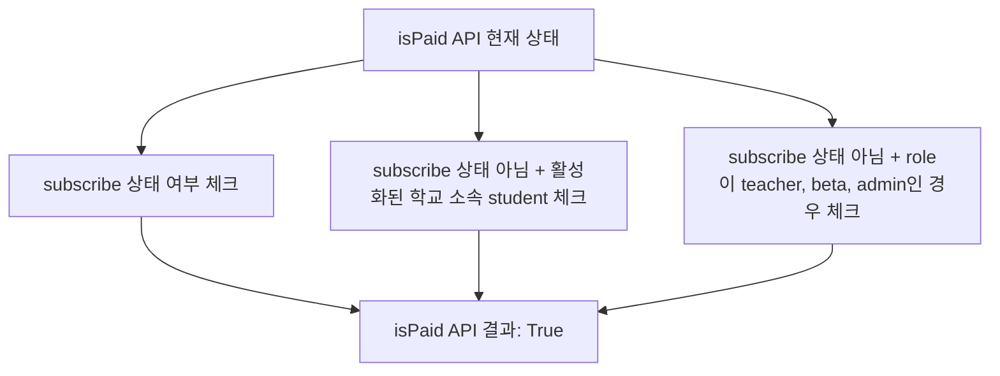

# career-architecture
> mermaid로 작성된 과제는 마크다운 파일(ARCHITECTURE.md)로 올려주시면 됩니다. (md 파일 내에 기존 구조를 넣어주세요) 
> 별도 아키택쳐나 모델링 도구를 사용한 경우에는 마크다운 파일(ARCHITECTURE.md)과 png, gif, jpg, pdf 파일 형식으로 architecture-{gitID}.png 파일명으로 upload 해주세요

# 요구사항

- [ ] 담당 하는 업무에서 비효율적인 프로세스나 기술적 개선을 하고 싶은 부분의 현재 구조를 문서화 한다.
    - [ ] 비효율적인 부분에 대한 분석내용을 정리한다.
    - [ ] 비효율적인 부분에 대한 프로세스 또는 시스템 구조를 그려본다.

## 🚀미션

- 이름 : 박서현

### 개선포인트 분석

- isPaid api 모호함
- 3년 전에 작성한 코드이고, 이후에, 요구사항이 변경되면서, isPaid api가 모호해짐
- 현재 isPaid api는,
    - subscribe 상태이거나,
    - subscribe 상태가 아니지만, 활성화된 학교에 속해있는 student이거나,
    - subscribe 상태가 아니지만, role 이, teacher, beta, admin 인 
    - 경우에만 true를 리턴함

- isPaid 가 아닌, isSubscribed 라는 함수 / role 체크하는 function 을 분리하고,
- 해당 function 을 Service 레이어로 분리해서, 유연하게 변경할 수 있도록 해야 함
- 변경된 요구 사항은, 하기와 같음 ( userRoleWithSubscription )
    - 결제한 교육용 pro 유저 : paidProEduUser
    - 결제한 일반 pro 유저 : paidProPersonalUser
    - 결제안한 교육용 유저 : unpaidEduUser
    - 결제안한 일반 유저 : unpaidPersonalUser

### 프로세스

