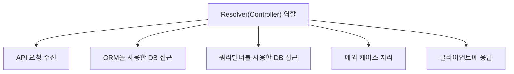

# career-architecture
>
> mermaid로 작성된 과제는 마크다운 파일(ARCHITECTURE.md)로 올려주시면 됩니다. (md 파일 내에 기존 구조를 넣어주세요) 
> 별도 아키택쳐나 모델링 도구를 사용한 경우에는 마크다운 파일(ARCHITECTURE.md)과 png, gif, jpg, pdf 파일 형식으로 architecture-{gitID}.png 파일명으로 upload 해주세요
>

# 요구사항

- [ ] 담당 하는 업무에서 비효율적인 프로세스나 기술적 개선을 하고 싶은 부분의 현재 구조를 문서화 한다.
  - [ ] 비효율적인 부분에 대한 분석내용을 정리한다.
  - [ ] 비효율적인 부분에 대한 프로세스 또는 시스템 구조를 그려본다.

## 🚀미션

- 이름 : 박서현

### 개선포인트 분석

- MVC 나, NestJS 와 같은 Framework 를 사용하지 않으며,Basic 한 NodeJS 백엔드 서버 구조
- MVC framework 에서, controller 역할을 하는 (Graphql 의 개념) resolver 함수가 모든 일을 처리함
  - api 요청 받고
  - ORM으로 repository or 쿼리빌더 로 DB 접근
  - 예외 케이스 처리 및 클라이언트에 응답하는 로직
  - 이 모든 코드들이, 모두 한 개의 resolver 함수에 있음 (resolver 는, Graphql 의 개념으로, MVC framework 에서, controller 역할을 함)
  - 이로 인해, resolver 함수가 너무 길어지고, 유지보수가 어려움

### 프로세스

