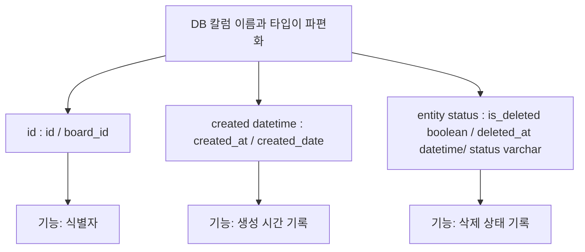

# career-architecture
> mermaid로 작성된 과제는 마크다운 파일(ARCHITECTURE.md)로 올려주시면 됩니다. (md 파일 내에 기존 구조를 넣어주세요) 
> 별도 아키택쳐나 모델링 도구를 사용한 경우에는 마크다운 파일(ARCHITECTURE.md)과 png, gif, jpg, pdf 파일 형식으로 architecture-{gitID}.png 파일명으로 upload 해주세요
# 요구사항
- [ ] 담당 하는 업무에서 비효율적인 프로세스나 기술적 개선을 하고 싶은 부분의 현재 구조를 문서화 한다.
    - [ ] 비효율적인 부분에 대한 분석내용을 정리한다.
    - [ ] 비효율적인 부분에 대한 프로세스 또는 시스템 구조를 그려본다.

## 🚀미션

- 이름 : 박서현

### 개선포인트 분석

- DB 테이블에서,
    - id / board_id
    - created_at / created_date
    - is_deleted / deleted_at / status
    - 위와 같이 유사한 기능인데, 다르게 칼럼 명, 타입으로 사용하는 경우가 많음
- 이로 인해, DB의 칼럼의 의미를 파악하기 어려움
- 신규로, DB 테이블 생성할 때, 매번 칼럼명, 타입을 고민하고, 정해야 함
- 기존 로직 모두를 한번에 바꾸는 것은 힘드나, 미리 Base Entity를 만들어서, 상속관계 형태로, class 선언하고, 신규로 생성하는 테이블에 상속받아서 사용하면, 향후, DB 칼럼명, 타입을 변경할 때, 편리함

### 프로세스

