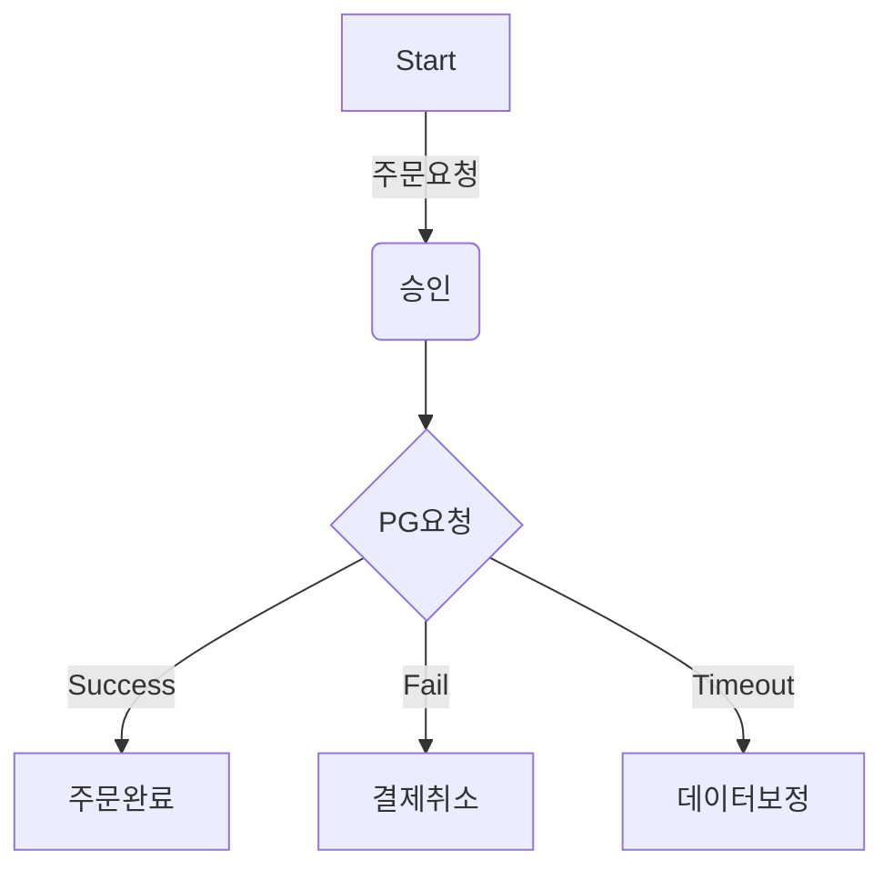
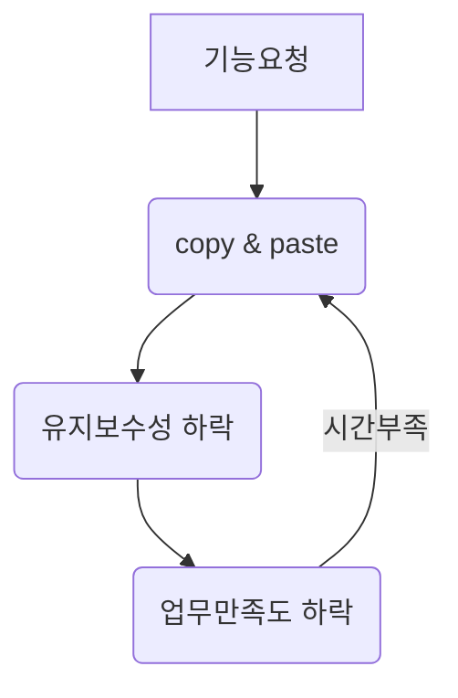

# career-architecture
> 개발하면서 불편 하거나 (비효율의 숙달화) 수기처리를 하는 업무에 대하여 프로세스나 시스템 아키텍쳐를 작성한다.
# 요구사항
- [ ] 자신의 하는 업무에서 개선하고 싶은 부분의 현제 상태를 문서화 한다.
    - [ ] 비효율적인 부분에 대한 분석내용을 정리한다.
    - [ ] 비효율적인 부분에 대한 프로세스 또는 시스템 구조를 그려본다.

## 🚀미션(해야할 일)

### 개선포인트 분석
- 비효율적인 프로세스나 학습을 통해 습득한 기술을 적용 해보는 것중 하나를 선택 하여 목표를 설정한다.
- 되도록이면 비효율적인 프로세스를 개선하여 성장을 위한 추가적인 리소스를 확보할 수 있는 것을 우선으로 잡아 본다.
- 과정기간내에 달성 가능한 목표를 잡아 본다.
#### 프로세스 개선
- 반복적으로 하고있는 업무 중 자동화 할 수 있거나 효율적으로 개선할 수 있는 프로세스를 작성한다.

#### 기술 적용

# 예시 1

## 🚀미션
### 개선포인트 분석
- 매일 전날의 결제 데이터중 timeout이 발생한 결제 건에 대한 리포트를 받아서 해당건을 확인 하고 있다.
- timeout이 발생하였을 경우 해당 건이 PG에서 결제가 되엇는지 안되엇는지? 알수 없기 때문에 해당 승인건의 key를 pg사의 관리자 페이지에서 하나하나 확인 한다.
- 승인되었다면 해당 건을 취소하고 운영DB에 결제 실패로 수기 처리한다.
- 승인이 되지 않았다면 운영DB에 결제 실패로 수기 처리한다.
 
### 프로세스

# 예시 2

## 🚀미션
### 개선포인트 분석
- 대부분의 업무가 기능 요청이 오면 기존의 비슷한 기능을 copy & paste해서 수정한다.
- copy를 하였기 때문에 새로운 기술의 적용이 어렵고 원본에서의 오류가 있다면 모든 copy된 파일을 수정해야하는 등 비효율적인 면이 많다.
### 프로세스

# 예시 3

## 🚀미션
### 개선포인트 분석
- myBatis로 되어있는 시스템을 JPA로 적용 해보고 싶다.
- 구성원들 대부분이 필요하다고 생각 하고 있지만 업무량이 많다보니 계속 미뤄지고 몇몇은 변경의 필요성도 느끼지 못하고 있음
- 지금 시스템에서 매일 결제된 데이터에 대한 리포트 데이터를 만드는 batch가 있는데 시스템 영향이 적고 적절한 사이즈로 보여 해당 부분을 jpa로 변경 해볼 수 있을것 같음.
### 기술적용 아키텍쳐
- As-Is

