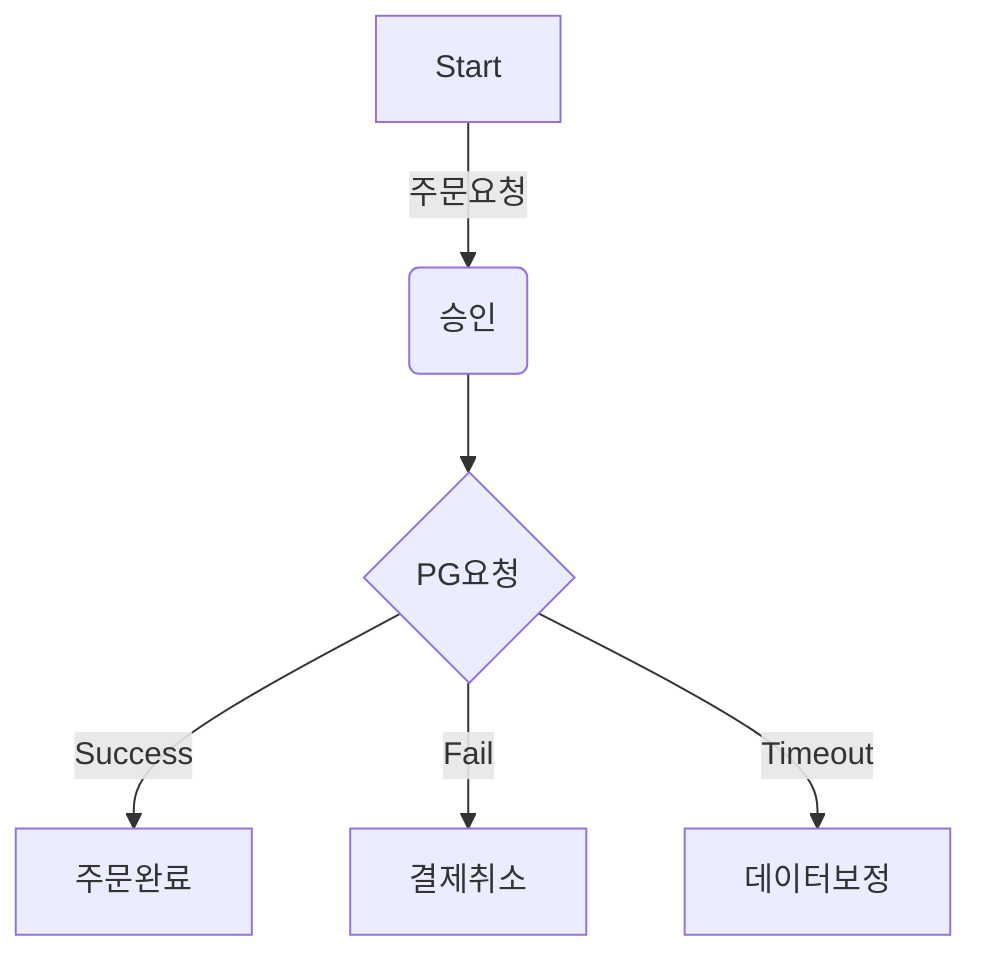
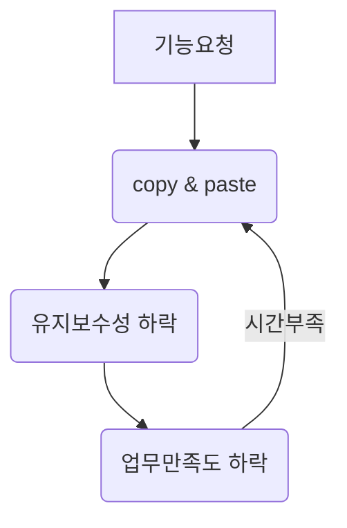

# career-architecture
> 개발하면서 불편 하거나 (비효율의 숙달화) 수기처리를 하는 업무에 대하여 프로세스나 시스템 아키텍쳐를 작성한다.
# 요구사항
- [ ] 자신의 하는 업무에서 개선하고 싶은 부분의 현제 상태를 문서화 한다.
    - [ ] 비효율적인 부분에 대한 분석내용을 정리한다.
    - [ ] 비효율적인 부분에 대한 프로세스 또는 시스템 구조를 그려본다.

## 🚀미션(해야할 일)

### 개선포인트 분석
- 비효율적인 프로세스나 학습을 통해 습득한 기술을 적용 해보는 것중 하나를 선택 하여 목표를 설정한다.
- 되도록이면 비효율적인 프로세스를 개선하여 성장을 위한 추가적인 리소스를 확보할 수 있는 것을 우선으로 잡아 본다.
- 과정기간내에 달성 가능한 목표를 잡아 본다.
#### 프로세스 개선
- 반복적으로 하고있는 업무 중 자동화 할 수 있거나 효율적으로 개선할 수 있는 프로세스를 작성한다.
- sample1

- sample2

#### 기술 적용

