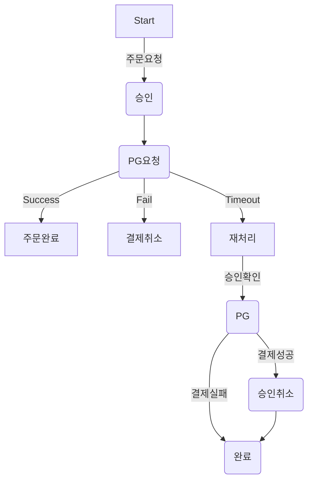

# career-architecture
> mermaid로 작성된 과제는 마크다운 파일(ARCHITECTURE.md)로 올려주시면 됩니다. (md 파일 내에 기존 구조를 넣어주세요)  
> 별도 아키택쳐나 모델링 도구를 사용한 경우에는 마크다운 파일(ARCHITECTURE.md)과 png, gif, jpg, pdf 파일 형식으로 architecture-{gitID}.png 파일명으로 upload 해주세요
# 요구사항
- [ ] 자신의 하는 업무에서 개선하고 싶은 부분의 개선 구조를 문서화 한다.
    - [ ] 비효율적인 부분에 대한 개선 기대효과를 정리한다.
    - [ ] 비효율적인 부분에 대한 개선된 프로세스 또는 시스템 구조를 그려본다.

## 🚀미션
### 기대효과 분석
- timeout 건을 처리하는데 매일 소요되는 2시간의 업무 시간을 30분 내외로 줄일 수 있다.
- 사람이 직접 하는 부분을 자동화 하여 실수를 줄일 수 있다.
    - 가끔 결제가 되었는데 timeout건으로 나왔으나 수기처리시 누락된 경우 고객의 CS 클래임이 인입되고 좋지않은 고객경험을 준다.
    - timeout 갤제 CS인입건 1건/week 을 0건으로 줄일 수 있다.
- 익일 처리되던 프로세스를 5분단위의 batch로 처리하여서 고객만족을 줄 수 있다.
    - 주문은 실패 했지만 결제가 되었다는 CS 건 3건/week를 0건으로 줄일 수 있다.
 
### 프로세스

