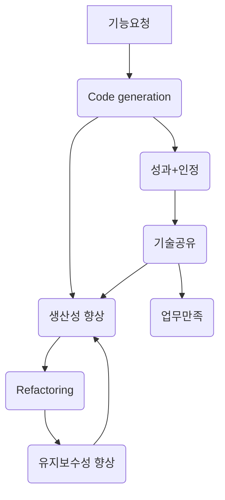

# career-architecture
> mermaid로 작성된 과제는 마크다운 파일(ARCHITECTURE.md)로 올려주시면 됩니다. (md 파일 내에 기존 구조를 넣어주세요)  
> 별도 아키택쳐나 모델링 도구를 사용한 경우에는 마크다운 파일(ARCHITECTURE.md)과 png, gif, jpg, pdf 파일 형식으로 architecture-{gitID}.png 파일명으로 upload 해주세요
# 요구사항
- [ ] 자신의 하는 업무에서 개선하고 싶은 부분의 개선 구조를 문서화 한다.
    - [ ] 비효율적인 부분에 대한 개선 기대효과를 정리한다.
    - [ ] 비효율적인 부분에 대한 개선된 프로세스 또는 시스템 구조를 그려본다.

## 🚀미션
### 기대효과 분석
- 비효율적인 반복 업무를 처리하는 시간을 8시간 에서 1시간으로 단축
- copy & paste로 하나의 변경을 위해 모든 class를 변경하는 작업을 코드생성기를 통해 3일 에서 1일로 단축
- 비효율적인 업무 리소스를 절감하여 시스템 구조를 개선할 리소스 확보( class 구조 변경을 통한 모듈화를 진행 할 리소스가 확보 될것으로 예상)
### 프로세스

