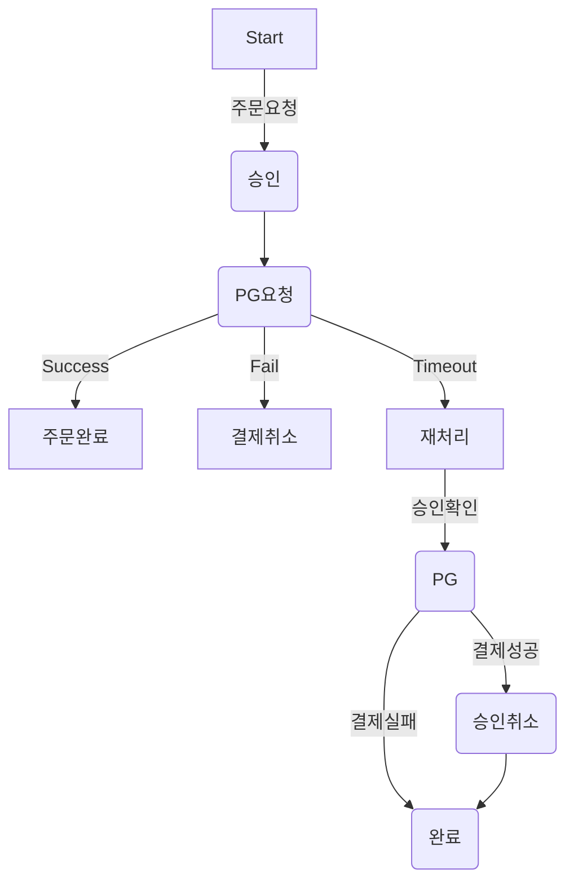
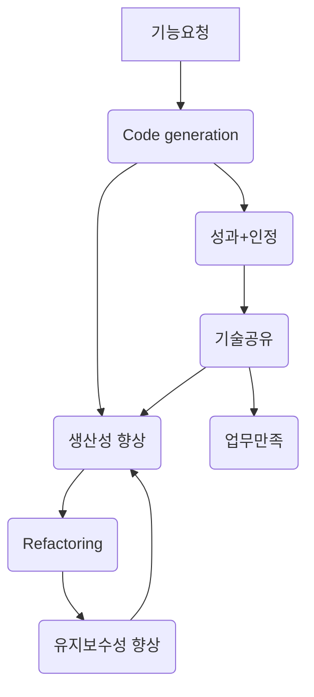

# career-architecture
> 개발하면서 불편 하거나 (비효율의 숙달화) 수기처리를 하는 업무에 대하여 개선 될 프로세스나 시스템 아키텍쳐를 작성한다.
# 요구사항
- [ ] 자신의 하는 업무에서 개선하고 싶은 부분의 개선 상태를 문서화 한다.
    - [ ] 비효율적인 부분에 대한 개선 기대효과를 정리한다.
    - [ ] 비효율적인 부분에 대한 개선된 프로세스 또는 시스템 구조를 그려본다.

## 🚀미션(해야할 일)

### 기대효과 분석
- 비효율적인 프로세스나 학습을 통해 습득한 기술을 적용 해보는 것중 하나를 선택 하고 개선하였을 때 어떤 부분이 좋아질 것인지 작성 해본다.
    - 이 일을 하는 Why가 필요하다.
- 기대효과는 가급적 수치화된 데이터가 나오도록 작성한다.
- 과정기간내에 달성 가능한 목표를 잡아 본다.
#### 프로세스 개선
- 반복적으로 하고있는 업무 중 자동화 할 수 있거나 효율적으로 개선할 수 있는 프로세스를 작성한다.

#### 기술 적용
- 기술적 변경내용을 작성한다.
- 기술의 변경이 되었을 때 어떤 효과가 있을것인지를 '기대효과'에 작성한다.

# 예시 1

## 🚀미션
### 기대효과 분석
- timeout 건을 처리하는데 매일 소요되는 2시간의 업무 시간을 30분 내외로 줄일 수 있다.
- 사람이 직접 하는 부분을 자동화 하여 실수를 줄일 수 있다.
    - 가끔 결제가 되었는데 timeout건으로 나왔으나 수기처리시 누락된 경우 고객의 CS 클래임이 인입되고 좋지않은 고객경험을 준다.
    - timeout 갤제 CS인입건 1건/week 을 0건으로 줄일 수 있다.
- 익일 처리되던 프로세스를 5분단위의 batch로 처리하여서 고객만족을 줄 수 있다.
    - 주문은 실패 했지만 결제가 되었다는 CS 건 3건/week를 0건으로 줄일 수 있다.
 
### 프로세스

# 예시 2

## 🚀미션
### 기대효과 분석
- 비효율적인 반복 업무를 처리하는 시간을 8시간 에서 1시간으로 단축
### 프로세스

# 예시 3

## 🚀미션
### 기대효과 분석
- JPA로 변경 되었을 경우 DB 의존성을 줄이고 쿼리 메핑으로 이해하는데 어려워 유지보수를 위해 학습에 걸리는 시간을 단축 할 수 있다. 
- 새로운 구성원이 와서 운영을 위핸 수정을 하기위해 기존 코드를 이해하기 위한 시간이 2시간 에서 1시간으로 50% 절감 예상
- DB변경이 있을경우 유지보수성이 높아진다. (기존 myBatis에서 쿼리수정 : 1일, JPA에서 처리 0.5일)
### 기술적용 아키텍쳐
- To-Be

